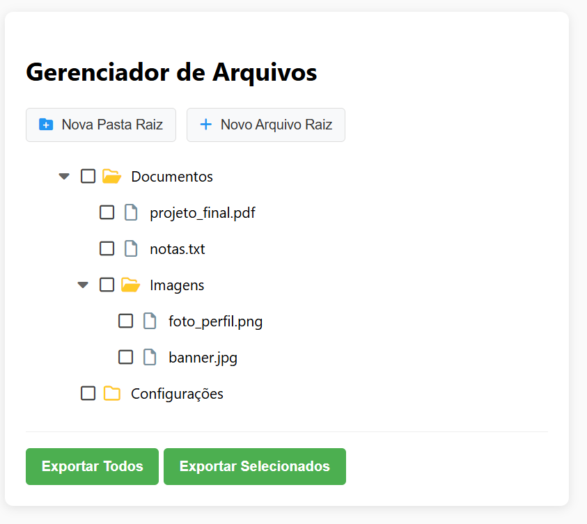
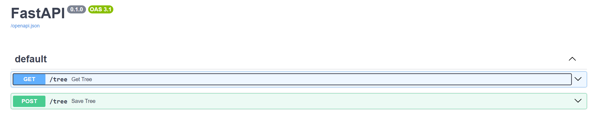

# Treeview

# Rest

# How

# Js

1. Inicie o servidor rest: `server\start.ps1`
2. Abra o arquivo: `javascript\index.html`

# Angular

1. Inicie o servidor rest: `server\start.ps1`
2. Inicie o docker: `angular\docker\iniciar_docker.ps1`
3. Dentro do docker: `./execute_angular.sh`
4. Acesse: `http://localhost:4200`
